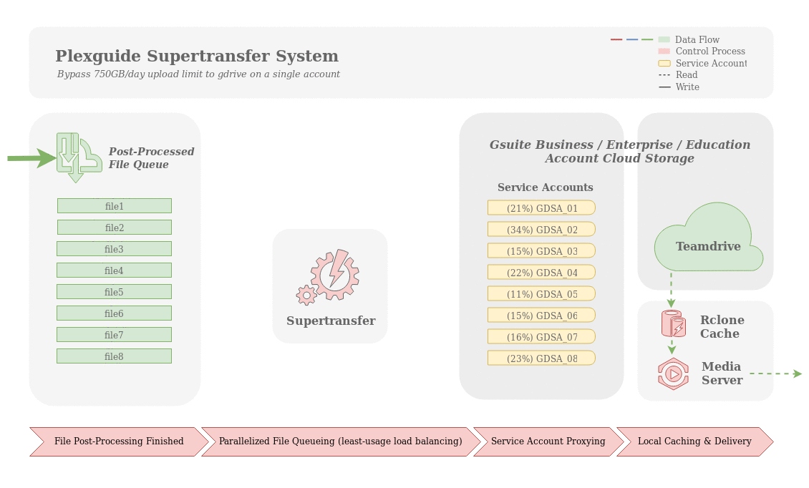

# PTS-MHA


**PTS is currently in maintenance mode and is considered feature complete.** From time-to-time developers will take it upon themselves to add new containers to Community-Apps as requested and update the Core-Apps whenever required.

We consider PTS to be a remarkable collaborative achievement and take pride in the fact we have built a solid foundation for any person to setup and learn basic Linux and also run a media server with minimal effort.

We encourage anyone wanting to contribute to the project in the future to join our community, this is also where we provide support: https://discord.gg/cKsMwMZ

Thanks to our valued contributors over the past couple of years, you have helped create something to be proud of and that will serve the community well into the future.

**You know who you are.** PTS is forever, others will come and go.

## How uploader works.

_____
    
## PTS-MHA commands

Update pts

```
sudo ptsupdate
```

Configure pts

```
sudo pts
```

## Configuring PTS

Configuring PTS fork is the same as configuring PG / PlexGuide.

Then type the following to run the PTS menu: `sudo pts`

* Set up and deploy Traefik ([see here](https://github.com/MHA-Team/PTS-Team/wiki/Traefik))   

* Close ports using Port Guard ([see here](https://github.com/MHA-Team/PTS-Team/wiki/PTS-Port-Guard))  

* Deploy PTS Shield (GOAuth - all apps supported) [see here](https://github.com/MHA-Team/PTS-Team/wiki/PTS-Shield)

* Set up and deploy PTS-Clone. You can restore you backup keys at this stage. [see here](https://github.com/MHA-Team/PTS-Team/wiki/PTS-Clone)

* (Optional) Restore PTS backup (created in step 1) using PTS-Vault. [see here](https://github.com/MHA-Team/PTS-Team/wiki/PTS-Vault---Data-Storage)

* Install desired core/community applications (Do this regardless of whether it is a fresh install with restore or overwrite)  [see here](https://github.com/MHA-Team/PTS-Team/wiki/core-apps)

* (Optional) If overwriting/restoring, you will need to change 2 remote path mappings in applications (NZB clients / Torrent clients / radarr / sonarr / lidarr etc)    [see here](https://github.com/MHA-Team/PTS-Team/wiki/Remote-Path-Mappings)

**Why do I need to change remote paths?**  

PTS will create one download folder for completed downloads using any NZB client `/mnt/downloads/nzb` and one download folder for completed downloads using any torrent client `/mnt/downloads/torrent`. Both folder names are different to those used in previous versions of PTS. This remote paths need to be changed in your configuration settings (nzbget/radarr/sonarr etc) which you can do in either in terminal or webUI.  

**NOTE**  PTS fork does **not** install PGUI by default.   

## Project Statement

PTS  is a **fork** of PG / Plexguide, an all-in-one media solution that deploys a Media Server through the use of either your local HDD or Google Drive; serving as unlimited back-end storage. PTS utilizes Ansible and Docker to streamline your Media Server while deploying multiple tools for your server operations.

## Functional Use

1. Deploys multiple programs/apps and functional within 10 - 30 seconds
1. Deploy PTS on a remote machine, local machine, VPS, or virtual machines
1. Deploy PTS utilizing Google's GSuite for unlimited space or through the solo or multiple HD editions
1. Deploys a Reverse Proxy (Traefik) so you can obtain https:// certificates on all your containers
1. Backup and Restore data through your Google Drive
1. Aligns data and ports for efficiency
1. Deploys with a simple installer and a GUI like interface (commands do not have to be typed out)

.....

## Recommended Reading

[**[Click Here]**](https://github.com/MHA-Team/PTS-Team/wiki/Pre-Reading) to view the list!

## Having Issues?
Contact Ownrack over ticket system or you can try to throubleshot contacting the community.

[**[Click Here]**](https://github.com/MHA-Team/PTS-Team/wiki/Common-Issues) for more information!